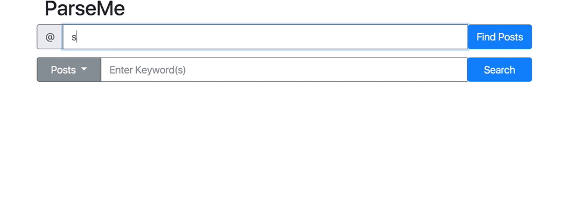
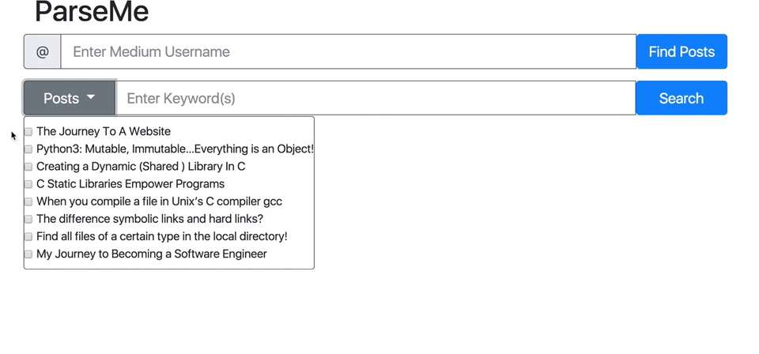
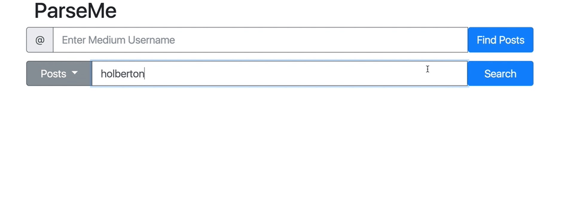
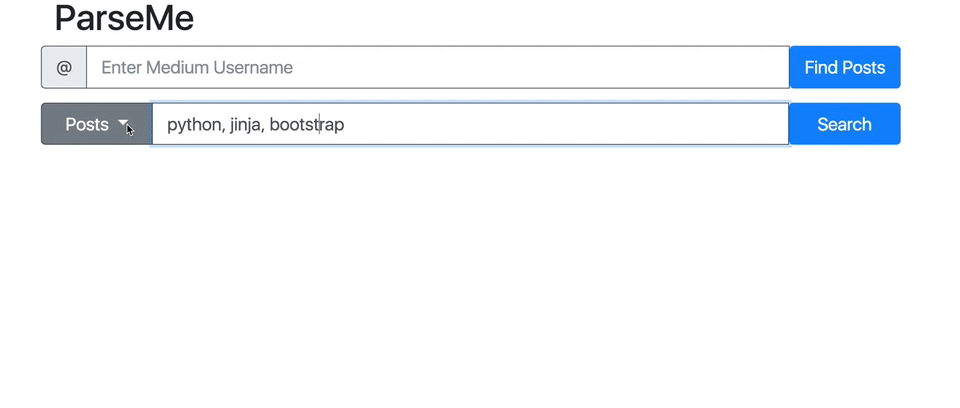

<p align="center">
   
</p>

# ParseMe

## Summary

This web app parses medium posts with the intent of being flexible to other sites. For Medium, the user enters a Medium username, selects the posts to parse, and then enters the word(s) to search for as shown below in the example.
The idea was inspired from needing an automation tool for blogs to help guide students in the write direction when figuring what content to incorporate in their blog.

## Getting Started

### Environment

* Vagrant 1.9.1 and VirtualBox on an Ubuntu image
* Ubuntu 14.04 LTS
* python 3.6.2

### Installing

#### Python 3.6.2

````
$ sudo apt-get update
$ sudo apt-get install python3.6
````

#### Create Python Virtual Environment

````
$ virtualenv virtualParse --python=python3
$ source virtualParse/bin/active
````

#### Modules To Install In Python Virtual Environment (virtualParse)

````
(virutalParse) $ pip install -r requirements.txt
````

### Run App

````
(virutalParse) $ python app.py
````

## Usage

<p align="center">
   
   
   
   	
</p>

## TODOs

### Front End

* Investigate using 2 forms

### Back End

* Investigate modifications for supporting 2 forms on the front end
* Possibly add feature to be able to enter multiple users
* Possibly add feature to show how many times a word appeared in each blog (currently just searches the amount of time it appears in all blogs selected)

## KNOWN BUGS

* Enter not working when user enters words for 'Word Search' the button must be clicked. It is currently being tied with just the first button
* Commas in words searched is not recognized
* If there is more than one 'section' in the blog parsed, the extra sections will not be considered at this time

## Authors

* Hunter Casbeer
* Joe McDaniel

## License

MIT License

## Acknowledgements

[Holberton School](https://www.holbertonschool.com/) for providing the mentors and resources to succeed.
